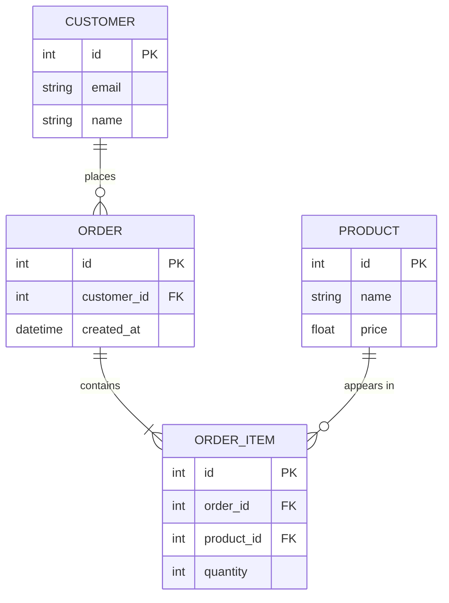

# ERD Generator
Turn a domain description into a validated Mermaid ER diagram and a rendered SVG.

## Paths
| Purpose | Path |
| --- | --- |
| Mermaid source (you write this) | `docs/architecture/schema.mmd` |
| Render Command | `node scripts/render_erd.js docs/architecture/schema.mmd` |
| Rendered Image (script will write this) | `docs/architecture/erd.svg` |

## Workflow

### 1. Parse the requirements
Before writing any syntax, extract from the user's request:

- **Entities**: the nouns that need to be stores (singular, `UPPER_SNAKE_CASE`, for example `ORDER_ITEM`).
- **Attributes**: each with a type (`int`, `string`, `float`, `boolean`, `datetime`).
- **Primary Keys**: mark with `PK`.
- **Foreign Keys**: mark with `FK` on the child side of each relationship.
- **Cardinalities**: one-to-one, one-to-many, many-to-many for every relationship.

Model many-to-many relationships with a junction entity that holds two `FK`s. If a requirement is ambiguous (for example whether an order can have zero items), pick the most reasonable  reading and state the assumption in the final answer rather than stopping to ask.

### 2. Write the Mermaid file

Write the draft directly to `docs/architecture/schema.mmd`, creating the directory if needed. Use this shape:


The file contains raw Mermaid only, with no Markdown code fences.

Cardinality reference (left side `||--o{` right side):

|Symbol | Meaning |
| --- | --- |
| `\|\|` | exactly one |
| `\|o` /  `o\|` | zero or one |
| `}o` / `o{` | zero or many |
| `}\|` / `\|{` | one or many |

Syntax rules that commonly cause failures: 

- The first line must be `erDiagram`.
- Entity names cannot contain spaces. Use underscores.
- Relationship labels with spaces must be quoted.
- Attribute lines are `type name [PK|FK]`, with the type first.
- Attribute names cannot contain spaces or hyphens.

### 3. Render

Run:

```bash
node scripts/render_erd.js docs/architecture/schema.mmd
```
- Exit code 0 and the output `SUCCESS` mean `docs/architecture/erd.svg` was generated. Go to step 5.
- Exit code 1 with output starting `SYNTAX_ERROR:` means compilation failed. Go to step 4.

### 4. Self-correction loop (maximum 3 retries)

If the render fails with `SYNTAX_ERROR`:

1. Read the stderr trace that follows the prefix. Find the reported line, token, or `Parse error` message.
2. Edit `docs/architecture/schema.mmd` to fix that specific problem. Change only what the error points to, and leave the rest of the diagram intact.
3. Re-run the render command from step 3.

Stop after 3 failed retries (4 total attempts). Then do not keep guessing. Report the last `SYNTAX_ERROR` trace verbatim, show the current contents of `schema.mmd`, and say what you suspect is wrong.

If the trace is not about diagram syntax (for example a missing browser, a sandbox launch failure, or `mmdc` not found), fixing the Mermaid file will not help. Report the environment problem immediately instead of retrying.

### 5. Final output

On success, reply with:

1. The final Mermaid source in a fenced code tagged `mermaid`, matching the contents of `docs/architecture/schema.mmd` exactly.
2. The path to the generated image: `docs/architecture/erd.svg`.
3. A short list of any assumptions made about cardinalities or keys.

Do not claim the SVG exists unless the render command printed `SUCCESS`.